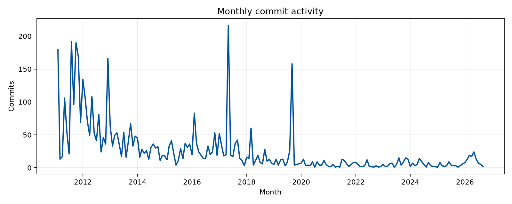
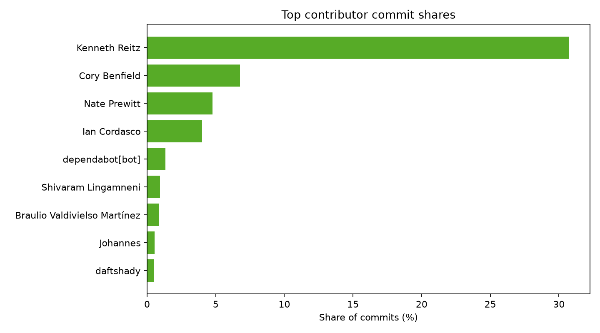
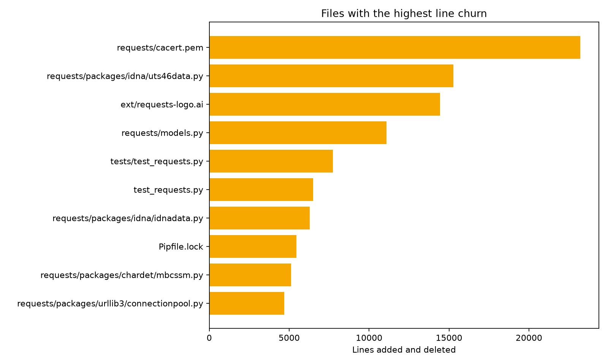

# RepoVitals report

Generated: 2026-09-25 17:33 UTC

## Repository summary

| Metric | Value |
|---|---:|
| Repository | `C:\Users\ui992624\Downloads\dataScienceInContextProgCourse\repovitals\playground\repos\requests` |
| Commits | 4,862 |
| Contributors | 794 |
| Files changed | 466 |
| Lines added | 161,376 |
| Lines deleted | 132,211 |
| Total churn | 293,587 |
| Binary changes | 48 |
| Renamed changes | 77 |
| First commit | 2011-02-13 18:41 UTC |
| Latest commit | 2026-09-21 20:22 UTC |

## Top contributors

| Contributor | Commits | Share |
|---|---:|---:|
| Kenneth Reitz | 1,494 | 30.7% |
| Kenneth Reitz | 697 | 14.3% |
| Cory Benfield | 329 | 6.8% |
| Nate Prewitt | 232 | 4.8% |
| Ian Cordasco | 195 | 4.0% |
| dependabot[bot] | 65 | 1.3% |
| Shivaram Lingamneni | 45 | 0.9% |
| Braulio Valdivielso Martínez | 42 | 0.9% |
| Johannes | 26 | 0.5% |
| daftshady | 24 | 0.5% |

## File hotspots

| File | Commits | Additions | Deletions | Churn |
|---|---:|---:|---:|---:|
| `requests/cacert.pem` | 10 | 11,607 | 11,607 | 23,214 |
| `requests/packages/idna/uts46data.py` | 3 | 7,634 | 7,634 | 15,268 |
| `ext/requests-logo.ai` | 4 | 11,577 | 2,855 | 14,432 |
| `requests/models.py` | 717 | 5,967 | 5,112 | 11,079 |
| `tests/test_requests.py` | 254 | 4,143 | 3,587 | 7,730 |
| `test_requests.py` | 366 | 4,611 | 1,879 | 6,490 |
| `requests/packages/idna/idnadata.py` | 3 | 3,144 | 3,144 | 6,288 |
| `Pipfile.lock` | 22 | 2,724 | 2,719 | 5,443 |
| `requests/packages/chardet/mbcssm.py` | 8 | 2,269 | 2,844 | 5,113 |
| `requests/packages/urllib3/connectionpool.py` | 70 | 2,606 | 2,080 | 4,686 |

## Direct dependency health

No direct dependencies were analyzed.
## Visualizations

## Interpretation

Dependency risk ratings are explainable heuristics based on release age, release availability, and source-repository metadata. A quiet project is not necessarily abandoned, so results should be reviewed rather than treated as proof.
