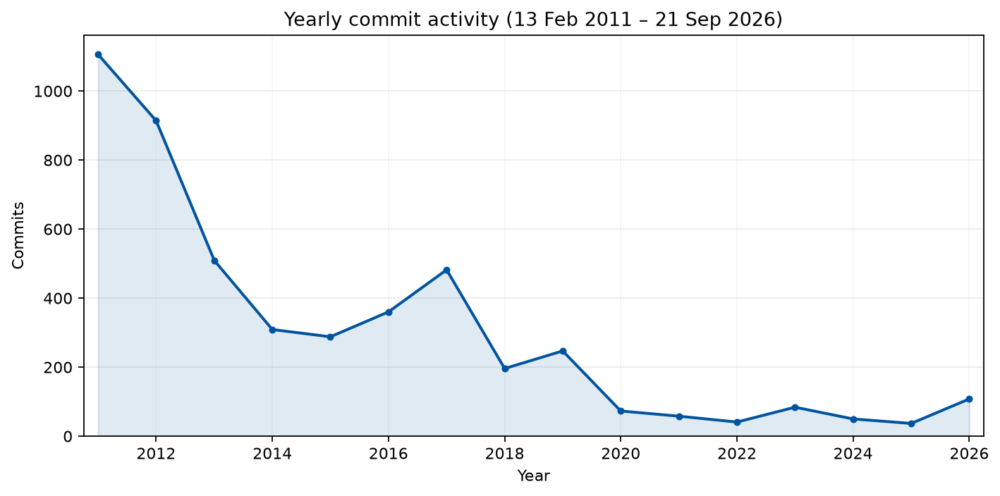
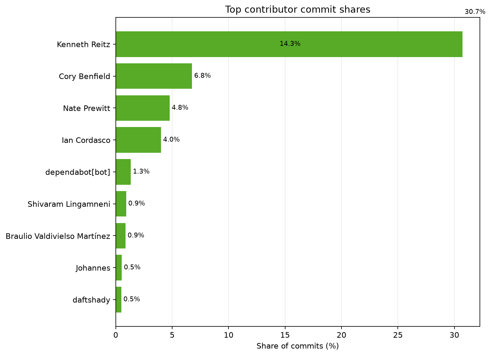
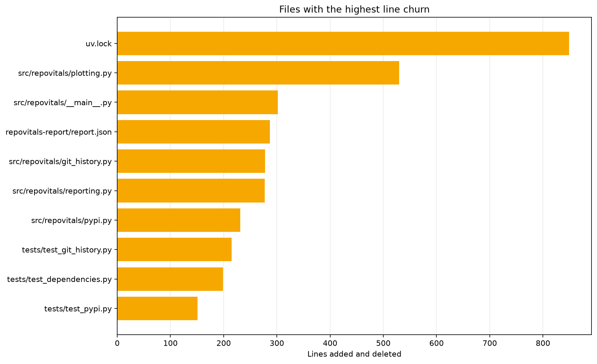

# RepoVitals report

Generated: 2026-09-28 20:45 UTC

## Repository summary

| Metric | Value |
|---|---:|
| Repository | `C:\Users\ui992624\Downloads\dataScienceInContextProgCourse\repovitals` |
| Commits | 28 |
| Contributors | 1 |
| Files changed | 33 |
| Lines added | 4,600 |
| Lines deleted | 250 |
| Total churn | 4,850 |
| Binary changes | 6 |
| Renamed changes | 0 |
| First commit | 2026-09-16 20:51 UTC |
| Latest commit | 2026-09-28 20:38 UTC |

## Top contributors

| Contributor | Commits | Share |
|---|---:|---:|
| Mustafa | 28 | 100.0% |

## File hotspots

| File | Commits | Additions | Deletions | Churn |
|---|---:|---:|---:|---:|
| `uv.lock` | 6 | 848 | 1 | 849 |
| `src/repovitals/plotting.py` | 3 | 453 | 77 | 530 |
| `src/repovitals/__main__.py` | 6 | 271 | 31 | 302 |
| `repovitals-report/report.json` | 4 | 219 | 68 | 287 |
| `src/repovitals/git_history.py` | 1 | 278 | 0 | 278 |
| `src/repovitals/reporting.py` | 2 | 277 | 0 | 277 |
| `src/repovitals/pypi.py` | 1 | 231 | 0 | 231 |
| `tests/test_git_history.py` | 1 | 215 | 0 | 215 |
| `tests/test_dependencies.py` | 1 | 199 | 0 | 199 |
| `tests/test_pypi.py` | 1 | 151 | 0 | 151 |

## Direct dependency health

| Package | Version | Latest release | Risk | Score |
|---|---|---|---|---:|
| matplotlib | 3.11.2 | 2026-09-11 19:05 UTC | Low | 0/100 |
| packaging | 26.3 | 2026-08-04 18:15 UTC | Low | 0/100 |
| pandas | 3.0.6 | 2026-09-17 23:23 UTC | Low | 0/100 |
| requests | 2.34.2 | 2026-05-14 19:25 UTC | Low | 0/100 |

### Dependency findings

#### matplotlib

- A release was published within the last year
- Source: https://github.com/matplotlib/matplotlib

#### packaging

- A release was published within the last year
- Source: https://github.com/pypa/packaging

#### pandas

- A release was published within the last year
- Source: https://github.com/pandas-dev/pandas

#### requests

- A release was published within the last year
- Source: https://github.com/psf/requests

## Visualizations

## Interpretation

Dependency risk ratings are explainable heuristics based on release age, release availability, and source-repository metadata. A quiet project is not necessarily abandoned, so results should be reviewed rather than treated as proof.
